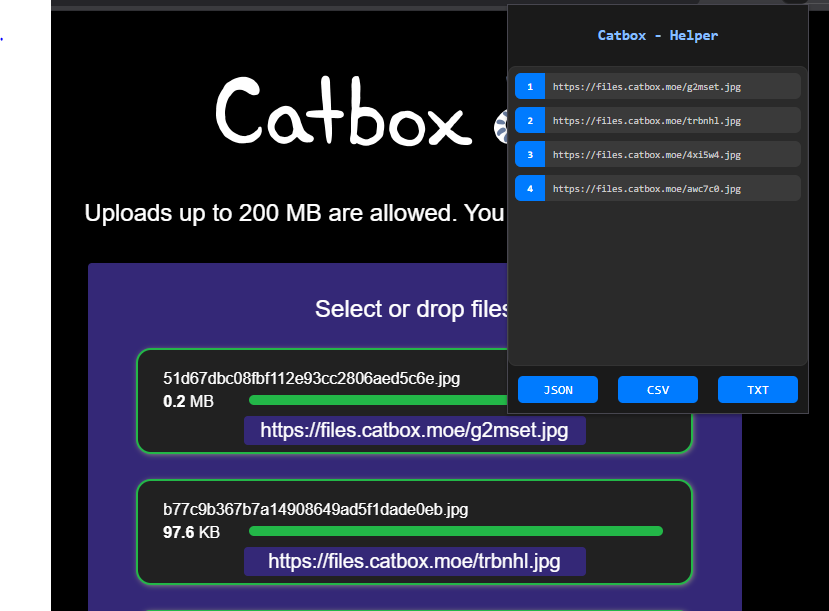

# Catbox Helper

Extension ligera para navegadores basados en Chromium que facilita la obtencion de enlaces al usar [Catbox.moe](https://catbox.moe).

---

### 💡 Problema
Cuando se suben varios archivos a `catbox.moe`, la pagina genera los enlaces de descarga uno por uno.  
Copiarlos manualmente puede ser tedioso y propenso a errores.

---

### ⚙️ Solucion
Catbox Helper recorre automaticamente el `DOM` de la pagina y extrae todos los enlaces generados de los archivos subidos.  
Permite exportarlos facilmente en tres formatos:  
- **TXT**  
- **JSON**  
- **CSV**

---

### 🚀 Uso
1. Subi tus archivos en [https://catbox.moe](https://catbox.moe)  
2. Espera a que se generen los enlaces  
3. Abri la extension Catbox Helper  
4. Los enlaces se mostraran listos para exportar en el formato que prefieras

---

### 🖼️ Ejemplo

---

### 📄 Licencia
Este proyecto se distribuye bajo la [licencia BSD 3-Clause](./LICENSE).  
Libre para usar, modificar y compartir, manteniendo la atribucion correspondiente.
